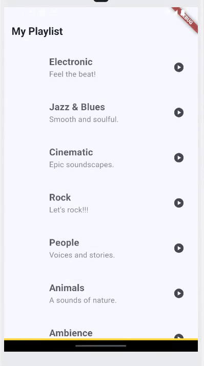
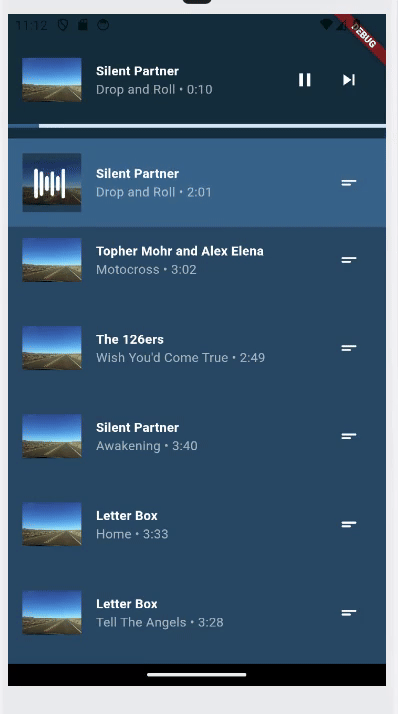
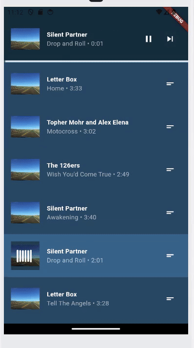

# Music Playlist App

A Flutter-based music playlist application that allows users to listen to music by categories. The app offers a smooth and interactive experience for browsing, managing, and playing music.

## Features

- **Categorize by Music Genre**: Easily browse music playlists organized by genre. Play entire albums directly from the playlist screen by pressing the play button for a specific category.

- **Play Songs**: Enjoy seamless music playback with basic controls, including play, pause, and next.

- **Song Progress Tracking**: A progress bar allows you to track the current song's progress and navigate through the track.

- **Reorder Songs in the Playlist**: Rearrange the order of songs within an album by dragging and dropping them using the drag icon on the right side of each track.

## Demo

Here are some GIFs showcasing the app's features:







## Getting Started

### Prerequisites

Ensure that you have the following installed on your system:

- [Flutter SDK](https://flutter.dev/docs/get-started/install) (latest stable version)
- [Android Studio](https://developer.android.com/studio) or [Xcode](https://developer.apple.com/xcode/) for iOS development
- A device or emulator to run the app

### Installation

1. Clone the repository:
   ```bash
   git clone https://github.com/polpanu16/MusicPlaylistApp.git
   cd music_playlist_app